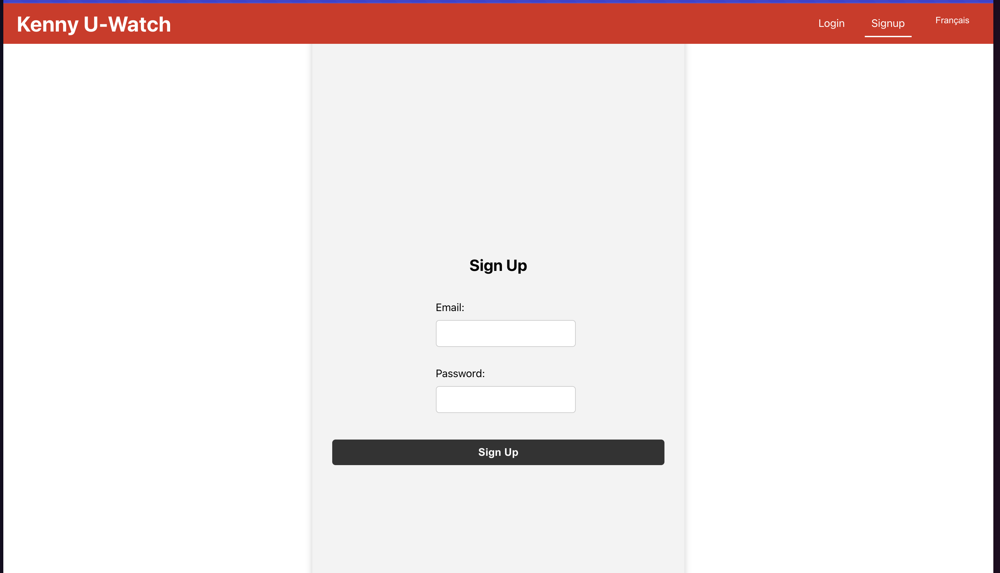

# Quick Start

This tutorial goes over how to get the application running locally for personal simple use. As long as it runs you will be able to get alerts whenever a new listing is found and the application leverages Docker to be able to run the services on any machine that supports Docker.

# Prerequistes
- Ensure to have Docker installed.
- Have an SMTP server set up to use (We will use Gmail in this tutorial)

##  How to install Docker
Follow the instructions on the [Docker website](https://docs.docker.com/get-docker/) to install Docker on your machine. I highly recommend using the Docker Desktop application as it makes it easy to manage your Docker containers and images. This tutorial will assume you are using Docker Desktop.

## Set up your SMTP server using Gmail to send emails
1. Have a Gmail account set up.
2. Have an application password set up for your Gmail account. See [here](https://support.google.com/accounts/answer/185833?hl=en) for instructions on how to set up an application password. Note that you will need to have 2FA enabled on your account to be able to set up an application password and the username will be the Gmail account email and the password will be the application password you set up here.

## Set up environment variables

Run the following commands in a terminal. Ensure to replace your `<username>` and `<password>` with your username and password. Ensure that you have set up your SMTP server as outlined above.

### Linux/MacOS
```bash
export EMAIL_HOST_USER=<username>
export EMAIL_HOST_PASSWORD=<password>
export EMAIL_HOST="smtp.gmail.com"
export EMAIL_PORT=587
```

### Windows
```shell
setx EMAIL_HOST_USER <username>
setx EMAIL_HOST_PASSWORD <password>
setx EMAIL_HOST "smtp.gmail.com"
setx EMAIL_PORT 587
```


# How to run

1. Ensure to set up .env files by running the following commands
```bash
cp ./user_watch_management/.env.example ./user_watch_management/.env
cp ./alert-producer/.env.example ./alert-producer/.env
```
Modify these files as needed.

2. Run the command `docker compose build` and wait for the command to complete with no errors (Note this may take a while the first time you run it as it needs to download all the dependencies and build the images).

3. Run `docker compose up`. This will start all the services and you should see the following in your Docker Desktop application:


4. Open your web browser and navigate to `http://localhost:3000/signup`. This is where the web app is hosted. Note it is possible the app is not loaded yet and is still starting up. If you do not see any page yet just wait a bit and try again.

4. You should now see the following screen and be ready to start creating alerts!



# Creating your first alert

1. First make your account by navigating to `http://localhost:3000/signup` and providing an email you wish to get alerts on and a password that only you will know. This is important for you to be able to log in and view and manage your alerts in the future.

2. Now navigate to `http://localhost:3000/login` and login with the same email and password provided above. You should be brought to the main dashboard.


3. In the top right corner click on Create an Alert or simply navigate to `http://localhost:3000/create-alert`. This is where you will enter the details fo the vehicle you wish to be alerted on. In this tutorial we will be creating an alert for a Honda Civic 2007 but note this can be used for any vehicle.

4. For `Manufacturer` enter `Honda`, for `Model` enter `Civic`, and for `Year` enter `2007`. Then click on the `Create Alert` button. You should then be brought back to the dashboard and your new alert has been created!


5. Keep an eye on your email to see if you get an alert. By default this application checks for postings every minute. You should get an email similar to the one shown below which will link you to the Kenny U-Pull website.


6. Congrats! Your Kenny U Pull browsing is now automated so you can have that little edge over other overs looking for parts :D!

7. Optional: Not required but I would love to hear what you think feel free to email me at [info.jeffreyboisvert@gmail.com](mailto:info.jeffreyboisvert@gmail.com)!

# Modifying/Deleting an alert

You cannot modify an alert the only way to modify it is to delete it and make a new one.
Each alert has a `Delete` button which will be used to delete the alert from the system.
